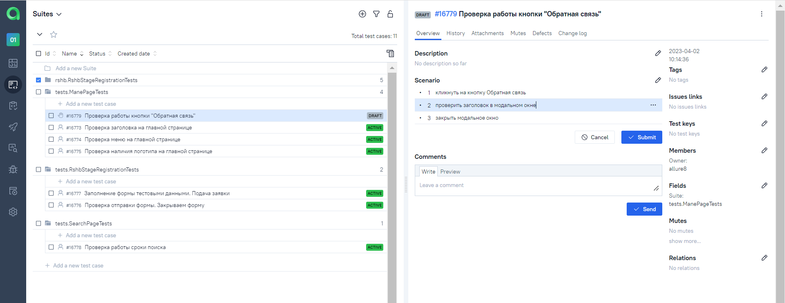
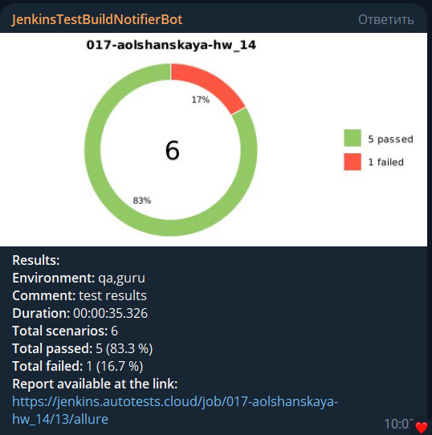
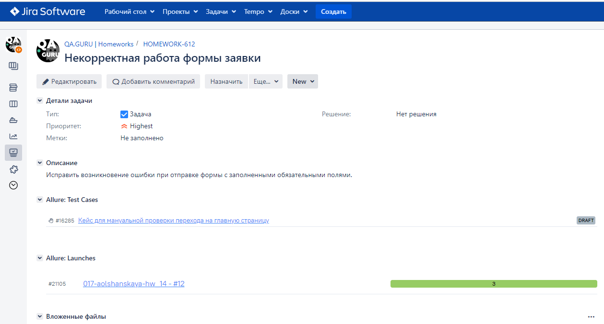

# <a href="https://rshbdigital.ru/stage"></a> Проект по автоматизации тестирования веб для РСХБ-интех (hw-14_rshb-intech_test)

## :technologist: Технологии и инструменты

<p  align="center">

<code></code>
<code></code>
<code></code>
<code></code>
<code></code>
<code></code>
<code></code>
<code></code>
<code></code>
<code></code>
<code></code>
<code></code>
</p>

## :heavy_check_mark: Список проверок, реализованных в автотестах

- [x] Проверка кликабельности кнопки "Подать заявку"
- [x] Проверка полей формы для отклика на стажировку
- [x] Проверка управляющих элементов формы 

## :heavy_check_mark: Список проверок, реализованных в ручных тестах

- [x] Проверка ссылок на главной странице
- [x] Проверка заголовков на главной странице
- [x] Проверка меню

## :rocket: Запуск тестов

###  :rocket: Локальный запуск :
```bash
gradle clean test
```

###  :rocket: Удаленный запуск (в Jenkins):
1. Открыть <a target="_blank" href="https://jenkins.autotests.cloud/job/017-aolshanskaya-hw_14/">проект</a>


2. Нажать **Собрать сейчас**
3. Результат запуска сборки можно посмотреть в отчёте Allure

## :triangular_flag_on_post: Allure отчеты:

### Отчет в Allure</a> <a target="_blank" href="https://jenkins.autotests.cloud/job/017-aolshanskaya-hw_14/12/allure/"> report</a>

#### :black_small_square: Основной отчет
<p align="center">

</p>

#### :black_small_square: Тесты
<p align="center">

</p>

### Отчет в Allure</a> <a target="_blank" href="https://allure.autotests.cloud/jobrun/19967"> TestOps</a>

#### :black_small_square: Основной отчет
<p align="center">

</p>

#### :black_small_square: Тесты
<p align="center">

</p>

#### :black_small_square: Пример ручных тестов
<p align="center">
  
</p>

## Telegram уведомления</a>

<p align="center">

</p>

## Atlassian Jira интеграция</a>
<p align="center">
  
</p>

##  Selenoid видеозапись тестов</a>
### Видеозапись прохождения тестов
<p align="center">
  
</p>
